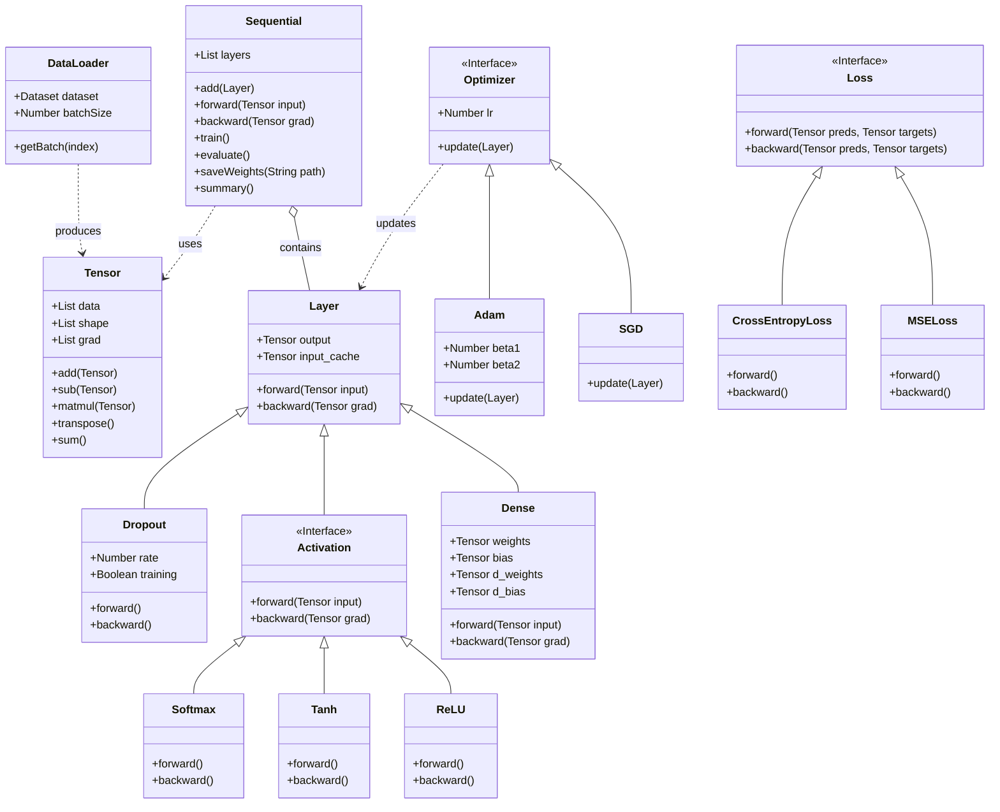

# 📊 RingML Class Diagram

This diagram represents the core architecture of the RingML framework, illustrating the relationships between Tensors, Layers, Models, and Optimizers.

```mermaid
classDiagram
    %% Core Engine
    class Tensor {
        +List data
        +List shape
        +List grad
        +add(Tensor)
        +sub(Tensor)
        +matmul(Tensor)
        +transpose()
        +sum()
    }

    %% Layers Module
    class Layer {
        +Tensor output
        +Tensor input_cache
        +forward(Tensor input)
        +backward(Tensor grad)
    }

    class Dense {
        +Tensor weights
        +Tensor bias
        +Tensor d_weights
        +Tensor d_bias
        +forward(Tensor input)
        +backward(Tensor grad)
    }

    class Activation {
        <<Interface>>
        +forward(Tensor input)
        +backward(Tensor grad)
    }

    class ReLU {
        +forward()
        +backward()
    }
    
    class Tanh {
        +forward()
        +backward()
    }
    
    class Softmax {
        +forward()
        +backward()
    }
    
    class Dropout {
        +Number rate
        +Boolean training
        +forward()
        +backward()
    }

    %% Model Module
    class Sequential {
        +List layers
        +add(Layer)
        +forward(Tensor input)
        +backward(Tensor grad)
        +train()
        +evaluate()
        +saveWeights(String path)
        +summary()
    }

    %% Optimization Module
    class Optimizer {
        <<Interface>>
        +Number lr
        +update(Layer)
    }

    class SGD {
        +update(Layer)
    }

    class Adam {
        +Number beta1
        +Number beta2
        +update(Layer)
    }

    %% Loss Module
    class Loss {
        <<Interface>>
        +forward(Tensor preds, Tensor targets)
        +backward(Tensor preds, Tensor targets)
    }

    class MSELoss {
        +forward()
        +backward()
    }

    class CrossEntropyLoss {
        +forward()
        +backward()
    }

    %% Data Module
    class DataLoader {
        +Dataset dataset
        +Number batchSize
        +getBatch(index)
    }

    %% Relationships
    Layer <|-- Dense
    Layer <|-- Activation
    Layer <|-- Dropout
    Activation <|-- ReLU
    Activation <|-- Tanh
    Activation <|-- Softmax

    Sequential o-- Layer : contains
    Sequential ..> Tensor : uses

    Optimizer <|-- SGD
    Optimizer <|-- Adam
    Optimizer ..> Layer : updates

    Loss <|-- MSELoss
    Loss <|-- CrossEntropyLoss
    
    DataLoader ..> Tensor : produces
```
